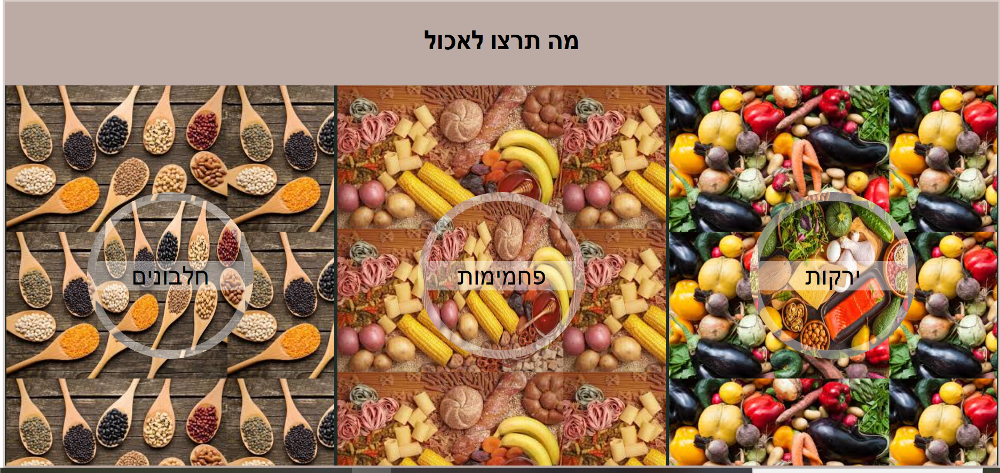
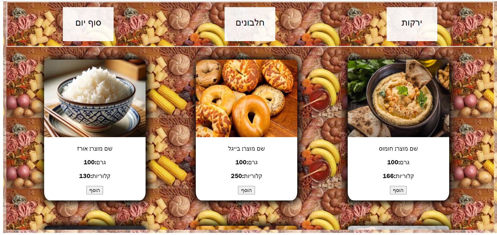
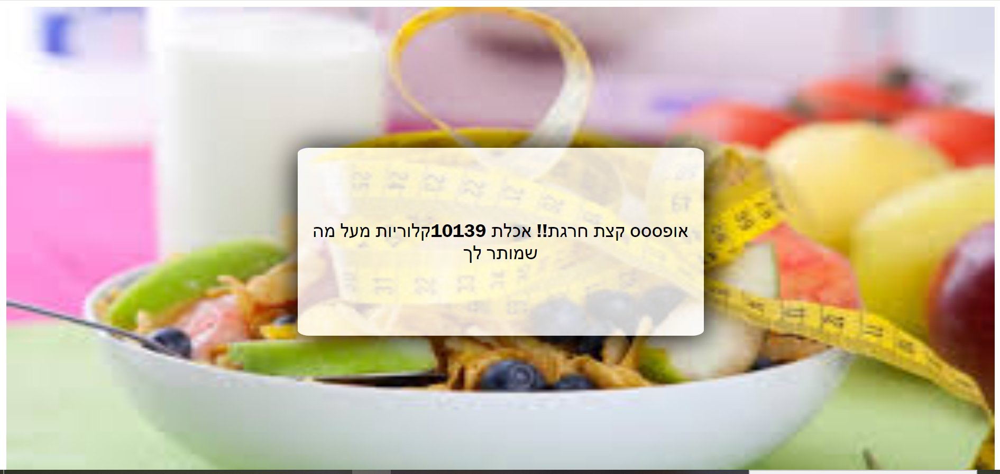

# 🥗 DailyCalorieCounter

## 📊 אפליקציית ניהול ומעקב אחר צריכת קלוריות יומית

האפליקציה מאפשרת למשתמשים לנהל מעקב אחר צריכת הקלוריות היומית שלהם ולוודא שהם עומדים ביעד התזונתי שהגדירו לעצמם.

---

## **⭐ תכונות עיקריות:**

###  1. **הרשמה אישית**
- כדי להתחיל להשתמש במערכת, יש להירשם ולספק מידע אישי.
- במהלך ההרשמה ניתן להגדיר את כמות הקלוריות היומית הרצויה.

###  2. **מעקב אחר האוכל**
- המערכת כוללת מאגר מוצרים רחב עם מידע על כמות הקלוריות לכל 100 גרם של כל מוצר.
- המשתמשים יכולים לבחור מוצרים מהמאגר, והמערכת תחשב באופן אוטומטי את סך הקלוריות שנצרכו.

###  3. **הצלחת שלי** 
- בכל שלב במהלך היום, המשתמש יכול לגשת לאזור "הצלחת שלי" ולצפות ברשימה מפורטת של כל המאכלים שצרך עד כה.

###  4. **מעקב יומי** 
- בסיום היום, ניתן ללחוץ על כפתור **"סיום יום"** כדי לקבל דו"ח מפורט על כמות הקלוריות שנצרכה.
- המערכת תציג אם היעד היומי הושג, אם חרגו ממנו או כמה קלוריות עדיין ניתן לצרוך.

---

## ✅ **איך להתחיל?**

1️⃣ **להירשם לאתר** ולהזין את הנתונים האישיים כולל היעד היומי לצריכת קלוריות.

2️⃣ **להזין את המזון הנצרך** במהלך היום.

3️⃣ **בסיום היום**, ללחוץ על **"סיום יום"** ולקבל נתונים מעודכנים על צריכת הקלוריות.

---

## 🛠️ **הטכנולוגיות מאחורי האפליקציה:**

- **Frontend:** *HTML, CSS, JavaScript*

  
- מאחר ואפליקציה זו פותחה ב-**JavaScript** היא אינה דורשת התקנות מיוחדות.
  
- האפליקציה פועלת ישירות בדפדפן האינטרנט שלכם, כך שכל שעליכם לעשות הוא להוריד את קבצי האפליקציה ולפתוח את קובץ ה-`Index.html`.

---

## 📥 **הוראות התקנה:**

### 1️⃣ **הורדת הפרויקט:**
- עברו לדף ה-GitHub של הפרויקט.
- לחצו על כפתור **"Code"** הירוק.
- בחרו **"Download ZIP"** והורידו את הפרויקט למחשב שלכם.
- חלצו את התיקייה מהקובץ ZIP.

### 2️⃣ **פתיחת הפרויקט:**
- אתרו את קובץ ה-`index.html`.
- לחצו עליו פעמיים כדי לפתוח אותו בדפדפן האינטרנט שלכם.

### 3️⃣ **הפעלה:**
- הפרויקט יפעל ישירות בדפדפן.

---

## 📸 **דפי הפרויקט:**

-

## 🤝 תרמו לפיתוח!

### תכנית פיתוח מורחבת :

#### שיפור פונקציונליות מעקב התזונה:

פיתוח מנגנון להזנת כמויות קלוריות משתנות, המאפשר מעקב מדויק וגמיש יותר מצריכת קלוריות.

#### הרחבת ושיפור מאגר נתוני המזון:

אינטגרציה של מנוע חיפוש מתקדם לשיפור נגישות ויעילות איתור מוצרי מזון.

וזמנים לתרום לפיתוח באמצעות **Pull Requests** ולהציע שיפורים!

------------------------------------------------------------------------------------------------------------------------------------------------------------

# 🥗 DailyCalorieCounter

## 📊 Calorie Tracking and Management App

The app allows users to track their daily calorie intake and ensure they meet their nutritional goals.

---

## **⭐ Key Features:**

###  1. **Personal Registration**

- To start using the system, you need to register and provide personal information.
  
- During registration, you can set your desired daily calorie intake goal.

###  2. **Food Tracking**

- The system includes a vast product database with information on the calorie content per 100 grams of each product.
  
- Users can select products from the database, and the system will automatically calculate the total calories consumed

###  3. **My Plate** 

- At any time during the day, users can go to the "My Plate" section and view a detailed list of all the foods they have consumed so far.

###  4. **Daily Tracking** 

- At the end of the day, you can click on the **"End Day"** button to receive a detailed report on the total calories consumed.
  
- The system will display whether the daily goal was achieved, if it was exceeded, or how many calories can still be consumed.

---

## ✅ **How to Get Started?**

1️⃣ **Register on the site** and enter personal data, including your daily calorie intake goal.

2️⃣ **Log the food consumed** throughout the day.

3️⃣ **At the end of the day**, click on **"End Day"** to get updated information on your calorie intake.

---

## 🛠️ **Technologies Behind the App:**

- **Frontend:** *HTML, CSS, JavaScript*

  
- Since this app was developed using **JavaScript**, it doesn't require special installations.
  
- The app runs directly in your web browser, so all you need to do is download the app files and open the `Index.html` file.

---

## 📥 **Installation Instructions:**

### 1️⃣ **Download the Project:**

- Go to the project's GitHub page.
  
- Click on the green **"Code"** button.
  
- Choose **"Download ZIP"** and download the project to your computer.
  
- Extract the folder from the ZIP file.

### 2️⃣ **Open the Project:**

- Locate the `index.html` file.
  
- Double-click it to open it in your web browser.

### 3️⃣ **Run the Project:**

- The project will run directly in your browser.

---

## 📸 **Project Screenshots:**

-

## 🤝 Contribute to Development!

### Expanded Development Plan:

#### Improving Food Tracking Functionality:

Developing a mechanism for entering varying calorie amounts, allowing for more precise and flexible tracking of calorie intake.

#### Expanding and Enhancing the Food Database:

Integrating an advanced search engine to improve accessibility and efficiency when searching for food products.

Feel free to contribute to development via **Pull Requests** and suggest improvements!

