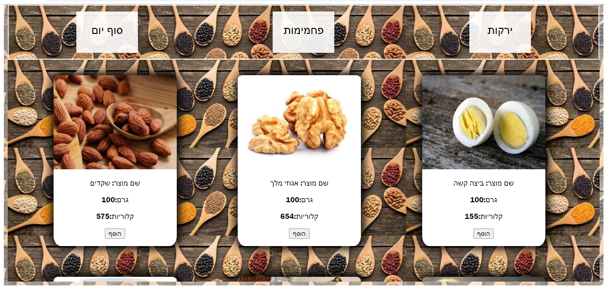

# 🥗 DailyCalorieCounter

## 📊 אפליקציית ניהול ומעקב אחר צריכת קלוריות יומית

האפליקציה מאפשרת למשתמשים לנהל מעקב אחר צריכת הקלוריות היומית שלהם ולוודא שהם עומדים ביעד התזונתי שהגדירו לעצמם.

---

## **⭐ תכונות עיקריות:**

###  1. **הרשמה אישית**
- כדי להתחיל להשתמש במערכת, יש להירשם ולספק מידע אישי.
- במהלך ההרשמה ניתן להגדיר את כמות הקלוריות היומית הרצויה.

###  2. **מעקב אחר האוכל**
- המערכת כוללת מאגר מוצרים רחב עם מידע על כמות הקלוריות לכל 100 גרם של כל מוצר.
- המשתמשים יכולים לבחור מוצרים מהמאגר, והמערכת תחשב באופן אוטומטי את סך הקלוריות שנצרכו.

###  3. **הצלחת שלי** 
- בכל שלב במהלך היום, המשתמש יכול לגשת לאזור "הצלחת שלי" ולצפות ברשימה מפורטת של כל המאכלים שצרך עד כה.

###  4. **מעקב יומי** 
- בסיום היום, ניתן ללחוץ על כפתור **"סיום יום"** כדי לקבל דו"ח מפורט על כמות הקלוריות שנצרכה.
- המערכת תציג אם היעד היומי הושג, אם חרגו ממנו או כמה קלוריות עדיין ניתן לצרוך.

---

## ✅ **איך להתחיל?**

1️⃣ **להירשם לאתר** ולהזין את הנתונים האישיים כולל היעד היומי לצריכת קלוריות.

2️⃣ **להזין את המזון הנצרך** במהלך היום.

3️⃣ **בסיום היום**, ללחוץ על **"סיום יום"** ולקבל נתונים מעודכנים על צריכת הקלוריות.

---

## 🛠️ **הטכנולוגיות מאחורי האפליקציה:**

- **Frontend:** *HTML, CSS, JavaScript*

  
- מאחר ואפליקציה זו פותחה ב-**JavaScript** היא אינה דורשת התקנות מיוחדות.
  
- האפליקציה פועלת ישירות בדפדפן האינטרנט שלכם, כך שכל שעליכם לעשות הוא להוריד את קבצי האפליקציה ולפתוח את קובץ ה-`Index.html`.

---

## 📥 **הוראות התקנה:**

### 1️⃣ **הורדת הפרויקט:**
- עברו לדף ה-GitHub של הפרויקט.
- לחצו על כפתור **"Code"** הירוק.
- בחרו **"Download ZIP"** והורידו את הפרויקט למחשב שלכם.
- חלצו את התיקייה מהקובץ ZIP.

### 2️⃣ **פתיחת הפרויקט:**
- אתרו את קובץ ה-`index.html`.
- לחצו עליו פעמיים כדי לפתוח אותו בדפדפן האינטרנט שלכם.

### 3️⃣ **הפעלה:**
- הפרויקט יפעל ישירות בדפדפן.

---

## 📸 **דפי הפרויקט:**

-

## 🤝 תרמו לפיתוח!

### תכנית פיתוח מורחבת :

#### שיפור פונקציונליות מעקב התזונה:

פיתוח מנגנון להזנת כמויות קלוריות משתנות, המאפשר מעקב מדויק וגמיש יותר מצריכת קלוריות.

#### הרחבת ושיפור מאגר נתוני המזון:

אינטגרציה של מנוע חיפוש מתקדם לשיפור נגישות ויעילות איתור מוצרי מזון.

וזמנים לתרום לפיתוח באמצעות **Pull Requests** ולהציע שיפורים!

------------------------------------------------------------------------------------------------------------------------------------------------------------

